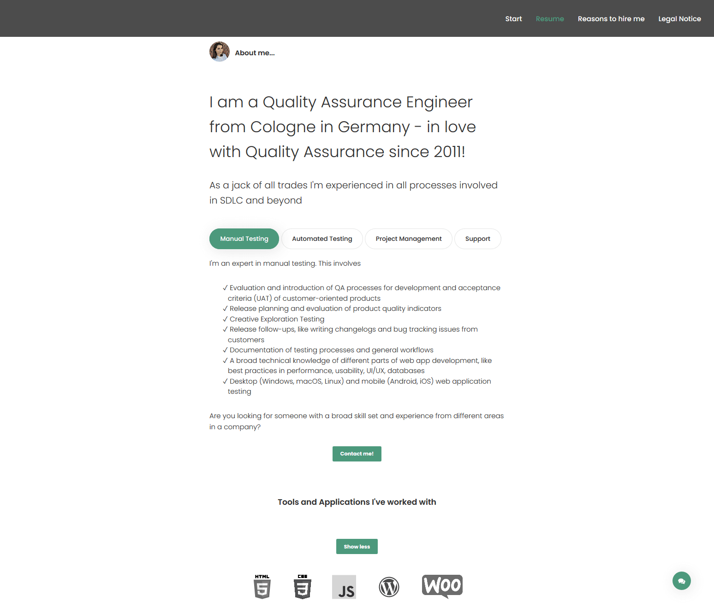

# Resume-Page
> This is a personal resumé page for me and my job as a quality assurance engineer. By building and adapting this page I'm constantly learning new things that I'll use in my future projects.

## Table of contents
- [Resume-Page](#resume-page)
  - [Table of contents](#table-of-contents)
  - [General info](#general-info)
  - [Screenshots](#screenshots)
  - [Technologies](#technologies)
  - [TODOS](#todos)
  - [Status](#status)
  - [Inspiration and Credits](#inspiration-and-credits)
    - [Fonts](#fonts)
    - [Icons](#icons)
    - [Libraries](#libraries)
    - [Plugins](#plugins)
  - [Contact](#contact)

## General info
My motivation for this project is to have a personal site and playground, where I can build something myself in order to learn to use programming languages and tools for web development in order to do better quality
assurance.

## Screenshots

## Technologies
* HTML5
* CSS4
* Bootstrap 4
* JavaScript

## TODOS
To-do list:
* Implement automated testing via Cypress.io
* Rewrite JQuery 
* Create a Contact Form

## Status
Project is: _in progress_

## Inspiration and Credits
Based on [Ja Theme by Suelo](https://elements.envato.com/ja-advanced-personal-resume-cv-vcard-template-YPFQA9)

### Fonts
1. Poppins - https://fonts.google.com/specimen/Poppins

### Icons
1. Themify Icons - http://themify.me/themify-icons
2. Font Awesome - http://fontawesome.io/

### Libraries
1. jQuery - http://jquery.com/
2. Bootstrap 4 - http://v4-alpha.getbootstrap.com/

### Plugins

1. Tether - http://tether.io/
2. Moment - http://momentjs.com/
3. Appear - http://morr.github.io/appear.html
4. LocalScroll - http://flesler.blogspot.com/2007/10/jquerylocalscroll-10.html
5. ScrollTo - https://github.com/flesler/jquery.scrollTo
6. Waypoint - http://imakewebthings.com/waypoints/
7. Validate - https://jqueryvalidation.org/
8. Slick - http://kenwheeler.github.io/slick/
9. Snap.svg - http://snapsvg.io/
10. Typed.js - http://www.mattboldt.com/demos/typed-js/
11. EasyPieChart - http://rendro.github.io/easy-pie-chart/
12. Masonry - https://masonry.desandro.com/
13. ImagesLoaded - https://imagesloaded.desandro.com/
14. Isotope - https://isotope.metafizzy.co/
15. Fullpage - https://alvarotrigo.com/fullPage/

## Contact
Always eager to get in touch with peaople thatenjoy everything related about Quality Assurance. Feel free to contact me.
